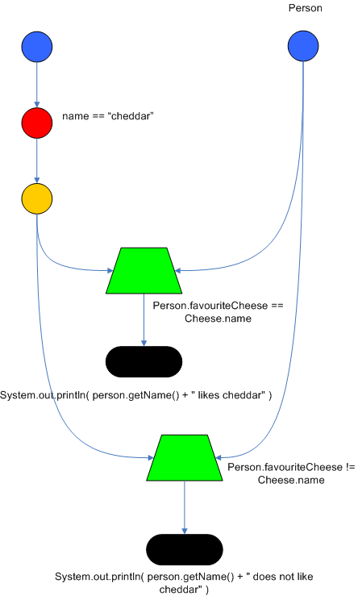
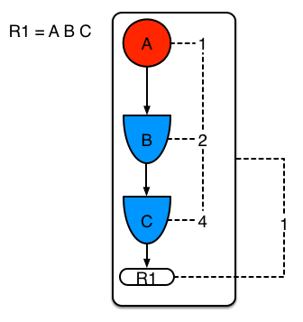
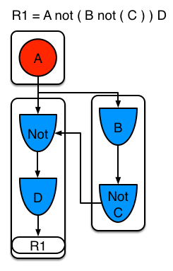
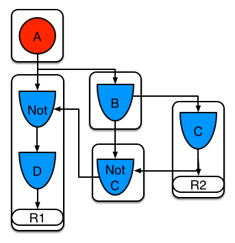

:data-uri:
:toc2:
:reteforgy: link:http://www.sciencedirect.com/science/article/pii/0004370282900200[version of the paper]
:marek: link:https://github.com/winklerm[Marek Winkler]
:drools: link:http://www.drools.org[Drools]
:dag: link:https://en.wikipedia.org/wiki/Directed_acyclic_graph[DAG]
:maven: link:https://maven.apache.org/[Maven]
image::images/rhheader.png[width=900]

:numbered!:
[abstract]
= PHREAK and RETEOO comparition

:numbered:

== Overview
The purpose of this reference architecture is to provide a batch execution of tests to generate result and comparition between the two supported algorithms of Drools engine: RETEOO and PHREAK.

== Credits
This project builds upon the outstanding contributions of {marek} and the Red Hat BRMS engineering team.

=== LEGAL

. This project is copyright of Red Hat, Inc. and distributed with an Apache 2 license
. This project is maintained by Red Hat's Global Partner Enablement team
. This project is a community project with no contractual support obligations
. Please contact Red Hat to discuss support details for Red Hat's BPM Suite 6 product.

=== Directory Structure

[source,console]
------
benchmark
├── README.md
├── doc
│   ├── images 
│   └── ref_arch.adoc
├── pom.xml
├── src
│   ├── main
│   │   ├── java
│   │   │   └── org
│   │   │       └── kie
│   │   │           └── examples
│   │   │               └── phreak
│   │   │                   ├── Benchmark.java
│   │   │                   ├── BenchmarkType.java
│   │   │                   ├── domain
│   │   │                   │   ├── Account.java
│   │   │                   │   ├── Person.java
│   │   │                   │   └── Transaction.java
│   │   │                   └── util
│   │   │                       └── DataGenerator.java
│   │   └── resources
│   │       ├── META-INF
│   │       │   ├── beans.xml
│   │       │   └── kmodule.xml
│   │       └── org
│   │           └── kie
│   │               └── examples
│   │                   └── phreak
│   │                       ├── grouping
│   │                       │   └── grouping.drl
│   │                       ├── laziness3
│   │                       │   └── laziness3.drl
│   │                       ├── laziness6
│   │                       │   └── laziness6.drl
│   │                       └── modification
│   │                           └── modification.drl
│   └── test
│       └── java
│           └── org
│               └── kie
│                   └── examples
│                       └── phreak
│                           └── BenchmarkTest.java
└── target
    ├── benchmark-1.0.0-SNAPSHOT.jar
------

== Pre-Requisites

. Familiarity with {drools}.
. Familiarity with Direct Acyclic Graph - {dag}.
. {maven} installed.

== Understanding RETE

The _Rete_ algorithm was invented by Dr. Charles Forgy and documented in his PhD thesis in 1978-79. A simplified {reteforgy} was published in 1982. The latin word "rete" means "net" or "network". The Rete algorithm can be broken into 2 parts: rule compilation and runtime execution.

The compilation algorithm describes how the Rules in the Production Memory are processed to generate an efficient discrimination network. In non-technical terms, a discrimination network is used to filter data as it propagates through the network. The nodes at the top of the network would have many matches, and as we go down the network, there would be fewer matches. At the very bottom of the network are the terminal nodes. In Dr. Forgy's 1982 paper, he described 4 basic nodes: root, 1-input, 2-input and terminal.

.Rete Nodes
image::images/rete_nodes.png[align=center]

The root node is where all objects enter the network. From there, it immediately goes to the ObjectTypeNode. The purpose of the ObjectTypeNode is to make sure the engine doesn't do more work than it needs to. For example, say we have 2 objects: Account and Order. If the rule engine tried to evaluate every single node against every object, it would waste a lot of cycles. To make things efficient, the engine should only pass the object to the nodes that match the object type. The easiest way to do this is to create an ObjectTypeNode and have all 1-input and 2-input nodes descend from it. This way, if an application asserts a new Account, it won't propagate to the nodes for the Order object. In Drools when an object is asserted it retrieves a list of valid ObjectTypesNodes via a lookup in a HashMap from the object's Class; if this list doesn't exist it scans all the ObjectTypeNodes finding valid matches which it caches in the list. This enables Drools to match against any Class type that matches with an `instanceof` check.

.ObjectTypeNode
image::images/object_type_nodes.png[align=center]

ObjectTypeNodes can propagate to AlphaNodes, LeftInputAdapterNodes and BetaNodes. AlphaNodes are used to evaluate literal conditions. Although the 1982 paper only covers equality conditions, many RETE implementations support other operations. For example, `Account.name == "Mr Trout"` is a literal condition. When a rule has multiple literal conditions for a single object type, they are linked together. This means that if an application asserts an `Account` object, it must first satisfy the first literal condition before it can proceed to the next AlphaNode. In Dr. Forgy's paper, he refers to these as IntraElement conditions. The following diagram shows the AlphaNode combinations for `Cheese( name == "cheddar", strength == "strong" )`:

.Alpha Nodes
image::images/alpha_nodes.png[align=center]

Drools extends Rete by optimizing the propagation from ObjectTypeNode to AlphaNode using hashing. Each time an AlphaNode is added to an ObjectTypeNode it adds the literal value as a key to the HashMap with the AlphaNode as the value. When a new instance enters the ObjectType node, rather than propagating to each AlphaNode, it can instead retrieve the correct AlphaNode from the HashMap,thereby avoiding unnecessary literal checks.

There are two two-input nodes, JoinNode and NotNode, and both are types of BetaNodes. BetaNodes are used to compare 2 objects, and their fields, to each other. The objects may be the same or different types. By convention we refer to the two inputs as left and right. The left input for a BetaNode is generally a list of objects; in Drools this is a Tuple. The right input is a single object. Two Nodes can be used to implement 'exists' checks. BetaNodes also have memory. The left input is called the Beta Memory and remembers all incoming tuples. The right input is called the Alpha Memory and remembers all incoming objects. Drools extends Rete by performing indexing on the BetaNodes. For instance, if we know that a BetaNode is performing a check on a String field, as each object enters we can do a hash lookup on that String value. This means when facts enter from the opposite side, instead of iterating over all the facts to find valid joins, we do a lookup returning potentially valid candidates. At any point a valid join is found the Tuple is joined with the Object; which is referred to as a partial match; and then propagated to the next node.

.Join Node
image::images/join_node.png[align=center]

To enable the first Object, in the above case Cheese, to enter the network we use a LeftInputNodeAdapter - this takes an Object as an input and propagates a single Object Tuple.

Terminal nodes are used to indicate a single rule having matched all its conditions; at this point we say the rule has a full match. A rule with an 'or' conditional disjunctive connective results in subrule generation for each possible logically branch; thus one rule can have multiple terminal nodes.

Drools also performs node sharing. Many rules repeat the same patterns, and node sharing allows us to collapse those patterns so that they don't have to be re-evaluated for every single instance. The following two rules share the first pattern, but not the last:

-----
rule
when
    Cheese( $cheddar : name == "cheddar" )
    $person : Person( favouriteCheese == $cheddar )
then
    System.out.println( $person.getName() + " likes cheddar" );
end
-----

-----
rule
when
    Cheese( $cheddar : name == "cheddar" )
    $person : Person( favouriteCheese != $cheddar )
then
    System.out.println( $person.getName() + " does not like cheddar" );
end
-----

As you can see below, the compiled Rete network shows that the alpha node is shared, but the beta nodes are not. Each beta node has its own TerminalNode. Had the second pattern been the same it would have also been shared.

.Node Sharing

== Understanding RETEOO
The ReteOO was developed throughout the 3, 4 and 5 series releases. It takes the RETE algorithm and applies well known enhancements, all of which are covered by existing academic literature:

* Node Sharing 

** Sharing is applied to both the alpha and beta network. The beta network sharing is always from the root pattern.

* Alpha indexing

** Alpha Nodes with many children use a hash lookup mechanism, to avoid testing each result.

* Beta indexing

** Join, Not and Exist nodes indexing their memories using a hash. This reduces the join attempts for equal checks. Recently range indexing was added to Not and Exists.

* Tree based graphs

 ** Join matches did not contain any references to their parent or children matches. Deletions would have to recalculate all join matches again, which involves recreating all those join match objects, to be able to find the parts of the network where the tuples should be deleted. This is called symmetrical propagation. A tree graph provides parent and children references, so a deletion is just a matter of following those references. This is asymmetrical propagation. The result is faster and less impact on the GC, and more robust because changes in values will not cause memory leaks if they happen without the engine being notified.

* Modify-in-place

** Traditional RETE implements a modify as a delete + insert. This causes all join tuples to be GC'd, many of which are recreated again as part of the insert. Modify-in-place instead propagates as a single pass, every node is inspected 

* Property reactive

 ** Also called "new trigger condition". Allows more fine grained reactivity to updates. A Pattern can react to changes to specific properties and ignore others. This alleviates problems of recursion and also helps with performance.

* Sub-networks

** Not, Exists and Accumulate can each have nested conditional elements, which forms sub networks.

* Backward Chaining

** Prolog style derivation trees for backward chaining are supported. The implementation is stack based, so does not have method recursion issues for large graphs.

* Lazy Truth Maintenance

** Truth maintenance has a runtime cost, which is incurred whether TMS is used or not. Lazy TMS only turns it on, on first use. Further it's only turned on for that object type, so other object types do not incur the runtime cost.

* Heap based agenda

** The agenda uses a binary heap queue to sort rule matches by salience, rather than any linear search or maintenance approach.

* Dynamic Rules

** Rules can be added and removed at runtime, while the engine is still populated with data.

== Understanding PHREAK

Drools 6 introduces a new algorithm, that attempts to address some of the core issues of RETE. The algorithm is not a rewrite form scratch and incorporates all of the existing code from ReteOO, and all its enhancements. While PHREAK is an evolution of the RETE algorithm, it is no longer classified as a RETE implementation. In the same way that once an animal evolves beyond a certain point and key characteristics are changed, the animal becomes classified as new species. There are two key RETE characteristics that strongly identify any derivative strains, regardless of optimizations. That it is an eager, data oriented algorithm. Where all work is doing done the insert, update or delete actions; eagerly producing all partial matches for all rules. PHREAK in contrast is characterised as a lazy, goal oriented algorithm; where partial matching is aggressively delayed.

This eagerness of RETE can lead to a lot of churn in large systems, and much wasted work. Where wasted work is classified as matching efforts that do not result in a rule firing.

PHREAK was heavily inspired by a number of algorithms; including (but not limited to) LEAPS, RETE/UL and Collection-Oriented Match. PHREAK has all enhancements listed in the ReteOO section. In addition it adds the following set of enhancements, which are explained in more detail in the following paragraphs.

* Three layers of contextual memory; Node, Segment and Rule memories.

* Rule, segment and node based linking.

* Lazy (delayed) rule evaluation.

* Isolated rule evaluation.

* Set oriented propagations.

* Stack based evaluations, with pause and resume.

When the PHREAK engine is started all rules are said to be unlinked, no rule evaluation can happen while rules are unlinked. The insert, update and deletes actions are queued before entering the beta network. A simple heuristic, based on the rule most likely to result in firings, is used to select the next rule for evaluation; this delays the evaluation and firing of the other rules. Only once a rule has all right inputs populated will the rule be considered linked in, although no work is yet done. Instead a goal is created, that represents the rule, and placed into a priority queue; which is ordered by salience. Each queue itself is associated with an AgendaGroup. Only the active AgendaGroup will inspect its queue, popping the goal for the rule with the highest salience and submitting it for evaluation. So the work done shifts from the insert, update, delete phase to the fireAllRules phase. Only the rule for which the goal was created is evaluated, other potential rule evaluations from those facts are delayed. While individual rules are evaluated, node sharing is still achieved through the process of segmentation, which is explained later.

Each successful join attempt in RETE produces a tuple (or token, or partial match) that will be propagated to the child nodes. For this reason it is characterised as a tuple oriented algorithm. For each child node that it reaches it will attempt to join with the other side of the node, again each successful join attempt will be propagated straight away. This creates a descent recursion effect. Thrashing the network of nodes as it ripples up and down, left and right from the point of entry into the beta network to all the reachable leaf nodes.

PHREAK propagation is set oriented (or collection-oriented), instead of tuple oriented. For the rule being evaluated it will visit the first node and process all queued insert, update and deletes. The results are added to a set and the set is propagated to the child node. In the child node all queued inset, update and deletes are processed, adding the results to the same set. Once finished that set is propagated to the next child node, and so on until the terminal node is reached. This creates a single pass, pipeline type effect, that is isolated to the current rule being evaluated. This creates a batch process effect which can provide performance advantages for certain rule constructs; such as sub-networks with accumulates. In the future it will leans itself to being able to exploit multi-core machines in a number of ways.

The Linking and Unlinking uses a layered bit mask system, based on a network segmentation. When the rule network is built segments are created for nodes that are shared by the same set of rules. A rule itself is made up from a path of segments, although if there is no sharing that will be a single segment. A bit-mask offset is assigned to each node in the segment. Also another bit mask (the layering) is assigned to each segment in the rule's path. When there is at least one input (data propagation) the node's bit is set to on. When each node has its bit set to on the segment's bit is also set to on. Conversely if any node's bit is set to off, the segment is then also set to off. If each segment in the rule's path is set to on, the rule is said to be linked in and a goal is created to schedule the rule for evaluation. The same bit-mask technique is used to also track dirty node, segments and rules; this allows for a rule already link in to be scheduled for evaluation if it's considered dirty since it was last evaluated.

This ensures that no rule will ever evaluate partial matches, if it's impossible for it to result in rule instances because one of the joins has no data. This is possible in RETE and it will merrily churn away producing martial match attempts for all nodes, even if the last join is empty.

While the incremental rule evaluation always starts from the root node, the dirty bit masks are used to allow nodes and segments that are not dirty to be skipped.

Using the existence of at at least one items of data per node, is a fairly basic heuristic. Future work would attempt to delay the linking even further; using techniques such as arc consistency to determine whether or not matching will result in rule instance firings.

Where as RETE has just a singe unit of memory, the node memory, PHREAK has 3 levels of memory. This allows for much more contextual understanding during evaluation of a Rule.

.PHREAK 3 Layered memory system
image::images/layered_memory.png[align=center]

Example 1 shows a single rule, with three patterns; A, B and C. It forms a single segment, with bits 1, 2 and 4 for the nodes. The single segment has a bit offset of 1.

.Example1: Single rule, no sharing

Example 2 demonstrates what happens when another rule is added that shares the pattern A. A is placed in its own segment, resulting in two segments per rule. Those two segments form a path, for their respective rules. The first segment is shared by both paths. When A is linked the segment becomes linked, it then iterates each path the segment is shared by, setting the bit 1 to on. If B and C are later turned on, the second segment for path R1 is linked in; this causes bit 2 to be turned on for R1. With bit 1 and bit 2 set to on for R1, the rule is now linked and a goal created to schedule the rule for later evaluation and firing.

When a rule is evaluated it is the segments that allow the results of matching to be shared. Each segment has a staging memory to queue all insert, update and deletes for that segment. If R1 was to evaluated it would process A and result in a set of tuples. The algorithm detects that there is a segmentation split and will create peered tuples for each insert, update and delete in the set and add them to R2's staging memory. Those tuples will be merged with any existing staged tuples and wait for R2 to eventually be evaluated.

.Example 2: Two rules, with sharing
image::images/segment2.png[align=center]

Example 3 adds a third rule and demonstrates what happens when A and B are shared. Only the bits for the segments are shown this time. Demonstrating that R4 has 3 segments, R3 has 3 segments and R1 has 2 segments. A and B are shared by R1, R3 and R4. While D is shared by R3 and R4.

.Example 3: Three rules, with sharing
image::images/segment3.png[align=center]

Sub-networks are formed when a Not, Exists or Accumulate node contain more than one element. In Example 4 "B not( C )" forms the sub network, note that "not ( C )" is a single element and does not require a sub network and is merged inside of the Not node.

The sub network gets its own segment. R1 still has a path of two segments. The sub network forms another "inner" path. When the sub network is linked in, it will link in the outer segment.

.Example 4 : Single rule, with sub-network and no sharing

Example 5 shows that the sub-network nodes can be shard by a rule that does not have a sub-network. This results in the sub-network segment being split into two.

.Example 5: Two rules, one with a sub-network and sharing

Not nodes with constraints and accumulate nodes have special behaviour and can never unlink a segment, and are always considered to have their bits on.

All rule evaluations are incremental, and will not waste work recomputing matches that it has already produced.

The evaluation algorithm is stack based, instead of method recursion. Evaluation can be paused and resumed at any time, via the use of a StackEntry to represent current node being evaluated.

When a rule evaluation reaches a sub-network a StackEntry is created for the outer path segment and the sub-network segment. The sub-network segment is evaluated first, when the set reaches the end of the sub-network path it is merged into a staging list for the outer node it feeds into. The previous StackEntry is then resumed where it can process the results of the sub network. This has the added benefit that all work is processed in a batch, before propagating to the child node; which is much more efficient for accumulate nodes.

The same stack system can be used for efficient backward chaining. When a rule evaluation reaches a query node it again pauses the current evaluation, by placing it on the stack. The query is then evaluated which produces a result set, which is saved in a memory location for the resumed StackEntry to pick up and propagate to the child node. If the query itself called other queries the process would repeat, with the current query being paused and a new evaluation setup for the current query node.

One final point on performance. One single rule in general will not evaluate any faster with PHREAK than it does with RETE. For a given rule and same data set, which using a root context object to enable and disable matching, both attempt the same amount of matches and produce the same number of rule instances, and take roughly the same time. Except for the use case with subnetworks and accumulates.

PHREAK can however be considered more forgiving that RETE for poorly written rule bases and with a more graceful degradation of performance as the number of rules and complexity increases.

RETE will also churn away producing partial machines for rules that do not have data in all the joins; where as PHREAK will avoid this.

So it's not that PHREAK is faster than RETE, it just won't slow down as much as your system grows :)

AgendaGroups did not help in RETE performance, as all rules where evaluated at all times, regardless of the group. The same is true for salience. Which is why root context objects are often used, to limit matching attempts. PHREAK only evaluates rules for the active AgendaGroup, and within that group will attempt to avoid evaluation of rules (via salience) that do not result in rule instance firings.

With PHREAK AgendaGroups and salience now become useful performance tools. The root context objects are no longer needed and potentially counter productive to performance, as they force the flushing and recreation of matches for rules.

== Analyzing Rules

== Understanding JMH (Java Microbenchmarking Harness)

JMH is a Java harness for building, running, and analysing nano/micro/milli/macro benchmarks written in Java and other languages targetting the JVM.

=== Basic Considerations

The recommended way to run a JMH benchmark is to use Maven to setup a standalone project that depends on the jar files of your application. This approach is preferred to ensure that the benchmarks are correctly initialized and produce reliable results. It is possible to run benchmarks from within an existing project, and even from within an IDE, however setup is more complex and the results are less reliable.

In all cases, the key to using JMH is enabling the annotation or bytecode processors to generate the synthetic benchmark code. Maven archetypes are the primary mechanism used to enable this. We strongly recommend new users make use of the archetype to setup the correct environment.

=== Preferred Usage: Command Line

Setting up the benchmarking project. The following command will generate the new JMH-driven project in test folder:

[source,console]
-----
$ mvn archetype:generate \
          -DinteractiveMode=false \
          -DarchetypeGroupId=org.openjdk.jmh \
          -DarchetypeArtifactId=jmh-java-benchmark-archetype \
          -DgroupId=org.sample \
          -DartifactId=test \
          -Dversion=1.0
-----

If you want to benchmark an alternative JVM language, use another archetype artifact ID from the list of existing ones, it usually amounts to replacing java to another language in the artifact ID given below. Using alternative archetypes may require additional changes in the build configuration, see the pom.xml in the generated project.
    
Building the benchmarks. After the project is generated, you can build it with the following Maven command:

[source,console]
-----
$ cd test/
$ mvn clean install
-----

Running the benchmarks. After the build is done, you will get the self-contained executable JAR, which holds your benchmark, and all essential JMH infrastructure code:

[source,console]
-----
$ java -jar target/benchmarks.jar
-----
    
Run with -h to see the command line options available:

[source,console]
-----
$ java -jar target/benchmarks.jar -h
-----

The result should be:

[source,console]
-----
Usage: java -jar ... [regexp*] [options]
 [opt] means optional argument.
 <opt> means required argument.
 "+" means comma-separated list of values.
 "time" arguments accept time suffixes, like "100ms".

  [arguments]                 Benchmarks to run (regexp+). 
  -bm <mode>                  Benchmark mode. Available modes are: [Throughput/thrpt, 
                              AverageTime/avgt, SampleTime/sample, SingleShotTime/ss, 
                              All/all] 
  -bs <int>                   Batch size: number of benchmark method calls per 
                              operation. (some benchmark modes can ignore this 
                              setting) 
  -e <regexp+>                Benchmarks to exclude from the run. 
  -f [int]                    How many times to forks a single benchmark. Use 0 to 
                              disable forking altogether (WARNING: disabling 
                              forking may have detrimental impact on benchmark 
                              and infrastructure reliability, you might want 
                              to use different warmup mode instead). 
  -foe [bool]                 Should JMH fail immediately if any benchmark had 
                              experienced the unrecoverable error? 
  -gc [bool]                  Should JMH force GC between iterations? 
  -h                          Display help. 
  -i <int>                    Number of measurement iterations to do. 
  -jvm <string>               Custom JVM to use when forking. 
  -jvmArgs <string>           Custom JVM args to use when forking. 
  -jvmArgsAppend <string>     Custom JVM args to use when forking (append these) 
                              
  -jvmArgsPrepend <string>    Custom JVM args to use when forking (prepend these) 
                              
  -l                          List matching benchmarks and exit. 
  -lprof                      List profilers. 
  -lrf                        List result formats. 
  -o <filename>               Redirect human-readable output to file. 
  -p <param={v,}*>            Benchmark parameters. This option is expected to 
                              be used once per parameter. Parameter name and parameter 
                              values should be separated with equals sign. Parameter 
                              values should be separated with commas. 
  -prof <profiler+>           Use profilers to collect additional data. See the 
                              list of available profilers first. 
  -r <time>                   Time to spend at each measurement iteration. 
  -rf <type>                  Result format type. See the list of available result 
                              formats first. 
  -rff <filename>             Write results to given file. 
  -si [bool]                  Synchronize iterations? 
  -t <int>                    Number of worker threads to run with. 
  -tg <int+>                  Override thread group distribution for asymmetric 
                              benchmarks. 
  -tu <TU>                    Output time unit. Available time units are: [m, s, 
                              ms, us, ns]. 
  -v <mode>                   Verbosity mode. Available modes are: [SILENT, NORMAL, 
                              EXTRA] 
  -w <time>                   Time to spend at each warmup iteration. 
  -wbs <int>                  Warmup batch size: number of benchmark method calls 
                              per operation. (some benchmark modes can ignore 
                              this setting) 
  -wf <int>                   How many warmup forks to make for a single benchmark. 
                              0 to disable warmup forks. 
  -wi <int>                   Number of warmup iterations to do. 
  -wm <mode>                  Warmup mode for warming up selected benchmarks. 
                              Warmup modes are: [INDI, BULK, BULK_INDI]. 
  -wmb <regexp+>              Warmup benchmarks to include in the run in addition 
                              to already selected. JMH will not measure these benchmarks, 
                              but only use them for the warmup. 
-----

=== Optional Usage: IDE

To execute from the IDE you can create the the project by using the archetype and importing the project into the IDE. The archetype will generate also an example class to provide the basic to start creating your benchmark.

[source,java]
------
public class MyBenchmark {

    @Benchmark
    public void testMethod() {
        // This is a demo/sample template for building your JMH benchmarks. Edit as needed.
        // Put your benchmark code here.
    }
}
------

Also there is an API that provides and easy way to execute your benchmarks and change the parameters to fit your needs.

[source,java]
------
    public static void main(String... args) throws Exception {
        Options opts = new OptionsBuilder()
                .include(".*")
                .warmupIterations(10)
                .measurementIterations(10)
                .jvmArgs("-server")
                .forks(1)
                .outputFormat(OutputFormatType.TextReport)
                .build();
     
        Map<BenchmarkRecord,RunResult> records = new Runner(opts).run();
        for (Map.Entry<BenchmarkRecord, RunResult> result : records.entrySet()) {
            Result r = result.getValue().getPrimaryResult();
            System.out.println("API replied benchmark score: "
                + r.getScore() + " "
                + r.getScoreUnit() + " over "
                + r.getStatistics().getN() + " iterations");
        }
    }
------

== Executing

To execute the JMH benchmark measuring PHREAK vs. RETE-OO performance on specific use-cases, where PHREAK should demonstrate its lazy (and more efficient) behaviour, you can run the following procedures:

* Build the project using Maven:

[source,console]
-----
$ mvn clean install
-----

* Then run the generated shaded jar:

[source,console]
-----
$ java -jar target/benchmark-1.0.0-SNAPSHOT.jar
-----

== Checking Results

[width="40%",frame="topbot",options="header"]
|======================
|Benchmark  					|(numOfTransactions)|(ruleEngine)|Mode|Samples|Mean   |Mean error|Units
|o.k.e.p.Benchmark.grouping     |				  10| 	   phreak|avgt|    200|0.815  |     0.022|ms/op
|o.k.e.p.Benchmark.grouping     |				  10| 	   reteoo|avgt|    200|1.500  |     0.014|ms/op
|o.k.e.p.Benchmark.grouping     |                100|      phreak|avgt|    200|3.673  |     0.120|ms/op
|o.k.e.p.Benchmark.grouping     |                100|      reteoo|avgt|    200|10.869 |     0.235|ms/op
|o.k.e.p.Benchmark.grouping     |               1000|      phreak|avgt|    200|36.000 |     0.473|ms/op
|o.k.e.p.Benchmark.grouping     |               1000|      reteoo|avgt|    200|115.826|     2.348|ms/op
|o.k.e.p.Benchmark.laziness3	|                 10|      phreak|avgt|    200|1.162  |     0.029|ms/op
|o.k.e.p.Benchmark.laziness3	|                 10|      reteoo|avgt|    200|1.524  |     0.026|ms/op
|o.k.e.p.Benchmark.laziness3	|                100|      phreak|avgt|    200|6.532  |     0.080|ms/op
|o.k.e.p.Benchmark.laziness3	|                100|      reteoo|avgt|    200|11.053 |     0.395|ms/op
|o.k.e.p.Benchmark.laziness3	|               1000|      phreak|avgt|    200|71.819 |     0.687|ms/op
|o.k.e.p.Benchmark.laziness3	|               1000|      reteoo|avgt|    200|102.217|     1.120|ms/op
|o.k.e.p.Benchmark.laziness6	|                 10|      phreak|avgt|    200|1.751  |     0.021|ms/op
|o.k.e.p.Benchmark.laziness6	|                 10|      reteoo|avgt|    200|2.669  |     0.029|ms/op
|o.k.e.p.Benchmark.laziness6	|                100|      phreak|avgt|    200|11.562 |     0.147|ms/op
|o.k.e.p.Benchmark.laziness6	|                100|      reteoo|avgt|    200|19.730 |     0.102|ms/op
|o.k.e.p.Benchmark.laziness6	|               1000|      phreak|avgt|    200|161.790|     2.300|ms/op
|o.k.e.p.Benchmark.laziness6	|               1000|      reteoo|avgt|    200|215.502|     2.014|ms/op
|o.k.e.p.Benchmark.modification |                 10|      phreak|avgt|    200|1.157  |     0.014|ms/op
|o.k.e.p.Benchmark.modification |                 10|      reteoo|avgt|    200|1.627  |     0.025|ms/op
|o.k.e.p.Benchmark.modification |                100|      phreak|avgt|    200|6.460  |     0.048|ms/op
|o.k.e.p.Benchmark.modification |                100|      reteoo|avgt|    200|10.885 |     0.153|ms/op
|o.k.e.p.Benchmark.modification |               1000|      phreak|avgt|    200|72.533 |     0.639|ms/op
|o.k.e.p.Benchmark.modification |               1000|      reteoo|avgt|    200|111.976|     1.046|ms/op
|======================

